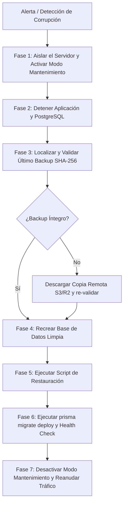

# 🛡️ Sistema de Respaldo y Recuperación de Base de Datos (Backup & Disaster Recovery)

Este documento describe la arquitectura, frecuencia, automatización, almacenamiento, validación de integridad y el **Protocolo de Recuperación ante Desastres (Disaster Recovery)** para la base de datos PostgreSQL de **TiendaDelki**.

---

## 1. Principio Fundamental: ¿Por qué una BD Online NO es un Backup?

> [!CAUTION]
> **Una base de datos en línea (incluso con réplicas de lectura, alta disponibilidad o en un proveedor cloud) NUNCA sustituye a un sistema de backups.**
> - Si un fallo lógico, migración errónea, error humano o inyección maliciosa ejecuta un `DROP TABLE` o `UPDATE` masivo, la réplica online replicará la corrupción de inmediato en tiempo real.
> - Si el proveedor cloud sufre una pérdida de cuenta, fallo de hardware a nivel de datacenter o ataque de ransomware, las copias locales en el mismo volumen se perderán simultáneamente.

Por ello, TiendaDelki implementa la regla de oro **3-2-1 de Respaldos**:
- **3 Copias de los datos:** Datos de producción activos, copia de respaldo local en servidor, copia remota fuera del servidor.
- **2 Tipos de medios:** Almacenamiento local NVMe + Almacenamiento de objetos en la nube (Cloudflare R2 / AWS S3).
- **1 Copia fuera del sitio (Offsite):** Ubicada en una región geográfica completamente independiente.

---

## 2. Estrategia y Frecuencia de Respaldos

| Tipo de Respaldo | Frecuencia | Hora | Retención | Ubicación |
| :--- | :--- | :--- | :--- | :--- |
| **Diario Automático** | Cada 24 horas | 03:00 UTC (Bajo tráfico) | 14 días | Local (`storage/backups/`) + Replicado a S3/R2 |
| **Semanal de Archivo** | Domingos | 04:00 UTC | 8 semanas | Bucket S3/R2 Frío (Cold Storage) |
| **Mensual Histórico** | Día 1 del mes | 05:00 UTC | 12 meses | Bucket S3/R2 Glaciar/Archive |
| **Pre-Despliegue** | Manual previo a `migrate` | Antes de cada release | 30 días | Local y máquina del administrador |

---

## 3. Formato de Volcado y Validación Criptográfica

Los scripts utilizan el formato personalizado de PostgreSQL (`-F c` en `pg_dump`):
- **Compresión nativa Zlib:** Reduce el volumen del archivo en más de un 70%.
- **Restauración selectiva:** Permite a `pg_restore` reorganizar tablas, excluir datos específicos o ejecutar restauración multi-hilo en paralelo (`-j 4`).
- **Checksum Criptográfico SHA-256:** Cada volcado genera automáticamente un archivo gemelo `.dump.sha256`. Ninguna restauración se ejecuta si el hash SHA-256 no coincide exactamente con el archivo original, previniendo restauraciones parciales o corruptas.

---

## 4. Herramientas y Scripts del Proyecto

El repositorio incluye herramientas nativas para entornos Linux y Windows:

```
TiendaDelki/
├── scripts/
│   ├── backup-db.sh      # Script de respaldo para Linux / Docker / Cron
│   ├── restore-db.sh     # Script de restauración e integridad para Linux
│   ├── backup-db.ps1     # Script de respaldo para Windows Server / PowerShell
│   └── restore-db.ps1    # Script de restauración e integridad para Windows
└── storage/
    └── backups/          # Directorio local predeterminado de almacenamiento
```

Ambos scripts leen automáticamente la variable `DATABASE_URL` del entorno o del archivo `.env`, purgan copias que superen el período de retención (`RETENTION_DAYS=14`), y generan el log de operación.

---

## 5. Automatización de Copias de Seguridad

### 5.1 En Linux (Servidor de Producción con Cron)

1. Otorgar permisos de ejecución a los scripts:
```bash
chmod +x /var/www/tiendadelki/scripts/backup-db.sh
chmod +x /var/www/tiendadelki/scripts/restore-db.sh
```

2. Editar el crontab del usuario de la aplicación (`tiendadelki`):
```bash
crontab -e -u tiendadelki
```

3. Agregar la tarea diaria a las 03:00 UTC con registro en log:
```cron
# Backup diario de PostgreSQL a las 03:00 UTC
0 3 * * * /var/www/tiendadelki/scripts/backup-db.sh >> /var/log/tiendadelki/backup.log 2>&1
```

### 5.2 Replicación Automática a Almacenamiento en la Nube (Offsite con Rclone / AWS CLI)
Para cumplir con el principio 3-2-1, instale `rclone` o `aws-cli` para sincronizar los volcados con un bucket de Cloudflare R2 o AWS S3:

```bash
# Ejemplo con AWS S3 o Cloudflare R2 (compatible S3):
# Agregar a continuación del backup en cron:
0 4 * * * aws s3 sync /var/www/tiendadelki/storage/backups/ s3://mi-bucket-backups-tiendadelki/postgre-backups/ --delete --endpoint-url https://<ID_CUENTA>.r2.cloudflarestorage.com
```

### 5.3 En Windows Server (Con Administrador de Tareas / schtasks)
```powershell
schtasks /create /tn "TiendaDelki_Backup_Diario" /tr "powershell.exe -ExecutionPolicy Bypass -File C:\var\www\TiendaDelki\scripts\backup-db.ps1" /sc daily /st 03:00 /ru "SYSTEM"
```

---

## 6. Procedimiento de Restauración Controlada

### 6.1 Restauración en Linux
Para restaurar un volcado, ejecute `restore-db.sh` especificando la ruta del archivo `.dump`:

```bash
cd /var/www/tiendadelki
./scripts/restore-db.sh storage/backups/tiendadelki_tiendadelki_prod_20260906_030000.dump
```

El script:
1. Verifica que el archivo exista.
2. Calcula el SHA-256 y lo compara contra el archivo `.sha256`. Si difieren, **aborta la ejecución**.
3. Solicita confirmación explícita antes de sobrescribir los datos.
4. Aplica el volcado mediante `pg_restore --clean --if-exists --no-owner`.

### 6.2 Restauración en Windows
```powershell
powershell -ExecutionPolicy Bypass -File ./scripts/restore-db.ps1 -BackupFile storage/backups/tiendadelki_tiendadelki_dev_20260906_025123.dump
```

---

## 7. Protocolo de Disaster Recovery (¿Qué hacer si la BD se corrompe?)

Si la base de datos sufre corrupción de bloques, daño de disco, o eliminación accidental de datos críticos, siga estrictamente este protocolo:



### Paso 1: Aislar el Tráfico Inmediatamente (Modo Mantenimiento)
Evitar que usuarios continúen intentando realizar pagos o transacciones mientras la base de datos está inestable:
```bash
# Habilitar página 503 en Nginx
sudo touch /var/www/tiendadelki/maintenance.flag
sudo systemctl reload nginx

# Detener proceso de la app para evitar escrituras parciales
pm2 stop tiendadelki
```

### Paso 2: Diagnosticar y Detener PostgreSQL
```bash
sudo systemctl status postgresql
sudo tail -n 100 /var/log/postgresql/postgresql-16-main.log
```

### Paso 3: Identificar el Último Respaldo Saludable
Localice el último archivo generado en `/var/www/tiendadelki/storage/backups/` o descárguelo de su bucket S3/R2:
```bash
ls -la /var/www/tiendadelki/storage/backups/
```
Verifique la integridad del archivo:
```bash
sha256sum -c tiendadelki_prod_YYYYMMDD_HHMMSS.dump.sha256
```

### Paso 4: Recrear la Base de Datos Limpia
Si el clúster o la base de datos sufrió corrupción física:
```bash
sudo -u postgres psql -c "DROP DATABASE IF EXISTS tiendadelki_prod;"
sudo -u postgres psql -c "CREATE DATABASE tiendadelki_prod OWNER tiendadelki_user;"
```

### Paso 5: Restaurar el Respaldo
```bash
/var/www/tiendadelki/scripts/restore-db.sh /var/www/tiendadelki/storage/backups/tiendadelki_prod_YYYYMMDD_HHMMSS.dump
```

### Paso 6: Sincronizar Migraciones Pendientes
En caso de que el respaldo restaurado sea de unas horas antes y hubiese migraciones pendientes:
```bash
cd /var/www/tiendadelki
npm run db:migrate:prod
```

### Paso 7: Validar la Salud del Sistema
Ejecutar el endpoint de diagnóstico de salud:
```bash
curl -I http://127.0.0.1:3000/api/health
```
Debe responder con código `HTTP 200 OK` y `"status": "healthy"`.

### Paso 8: Desactivar Modo Mantenimiento
```bash
pm2 start tiendadelki
sudo rm /var/www/tiendadelki/maintenance.flag
sudo systemctl reload nginx
```

---

## 8. Calendario de Pruebas de Recuperación (Disaster Drills)

Un respaldo no probado **no es un respaldo**.
- **Frecuencia del simulacro:** El primer lunes de cada trimestre.
- **Procedimiento:** Restaurar el respaldo más reciente en un servidor de staging o base de datos de pruebas local.
- **Validación:** Confirmar que se puedan consultar productos, iniciar sesión con el usuario administrador y revisar el historial de pedidos sin errores de integridad referencial.
