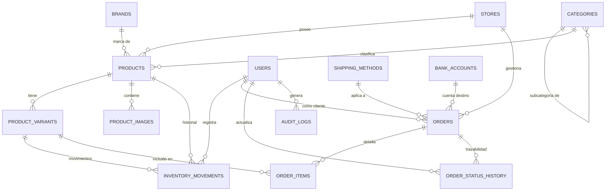

# ESPECIFICACIÓN DEL MODELO DE BASE DE DATOS (DATABASE.MD)

**Sistema:** TiendaDelki E-Commerce & Control Físico  
**Motor:** PostgreSQL 16+  
**ORM / Abstracción:** Prisma ORM  
**Codificación:** UTF-8 / Collation: C.UTF-8  

---

## 1. DIAGRAMA ENTIDAD-RELACIÓN (ERD)



---

## 2. ESQUEMA RELACIONAL DETALLADO

### 2.1 Tablas de Organización y Usuarios

#### `stores` *(Preparación de Marketplace)*
Permite aislar la tienda física principal y deja la puerta abierta para vendedores externos sin tocar el esquema más adelante.
* `id`: `VARCHAR(36)` (UUIDv4 / CUID) - **PK**
* `name`: `VARCHAR(150)` - NOT NULL (ej. "TiendaDelki Principal")
* `slug`: `VARCHAR(150)` - UNIQUE, NOT NULL
* `is_default`: `BOOLEAN` - DEFAULT TRUE (Indica la tienda física matriz)
* `is_active`: `BOOLEAN` - DEFAULT TRUE
* `created_at`: `TIMESTAMPTZ` - DEFAULT NOW()
* `updated_at`: `TIMESTAMPTZ` - DEFAULT NOW()

#### `users`
Maneja administradores, empleados de tienda y clientes registrados.
* `id`: `VARCHAR(36)` - **PK**
* `email`: `VARCHAR(255)` - UNIQUE, NULLABLE (para clientes de paso o empleados identificados por username)
* `password_hash`: `VARCHAR(255)` - NULLABLE (los clientes que compran como invitado no tienen contraseña)
* `first_name`: `VARCHAR(100)` - NOT NULL
* `last_name`: `VARCHAR(100)` - NOT NULL
* `phone`: `VARCHAR(30)` - INDEXED, NULLABLE
* `whatsapp`: `VARCHAR(30)` - NULLABLE
* `role`: `VARCHAR(20)` - NOT NULL, DEFAULT `'CUSTOMER'` (`'SUPER_ADMIN'`, `'ADMIN'`, `'STAFF'`, `'CUSTOMER'`)
* `is_active`: `BOOLEAN` - DEFAULT TRUE
* `created_at`: `TIMESTAMPTZ` - DEFAULT NOW()
* `updated_at`: `TIMESTAMPTZ` - DEFAULT NOW()

#### `customer_addresses`
Direcciones guardadas para clientes recurrentes.
* `id`: `VARCHAR(36)` - **PK**
* `user_id`: `VARCHAR(36)` - FK -> `users(id)` ON DELETE CASCADE
* `label`: `VARCHAR(50)` - DEFAULT `'Casa'` (ej. "Casa", "Oficina")
* `recipient_name`: `VARCHAR(150)` - NOT NULL
* `recipient_phone`: `VARCHAR(30)` - NOT NULL
* `street_address`: `TEXT` - NOT NULL
* `sector_or_neighborhood`: `VARCHAR(120)` - NOT NULL
* `city`: `VARCHAR(100)` - NOT NULL
* `province_or_state`: `VARCHAR(100)` - NOT NULL
* `postal_code`: `VARCHAR(20)` - NULLABLE
* `delivery_notes`: `TEXT` - NULLABLE (ej. "Casa verde frente al parque")
* `is_default`: `BOOLEAN` - DEFAULT FALSE
* `created_at`: `TIMESTAMPTZ` - DEFAULT NOW()

---

### 2.2 Tablas del Catálogo de Productos

#### `categories`
Categorías organizadas jerárquicamente (ej. Ropa -> Hombres -> Camisas).
* `id`: `VARCHAR(36)` - **PK**
* `parent_id`: `VARCHAR(36)` - FK -> `categories(id)` ON DELETE SET NULL, NULLABLE
* `name`: `VARCHAR(100)` - NOT NULL
* `slug`: `VARCHAR(120)` - UNIQUE, NOT NULL
* `description`: `TEXT` - NULLABLE
* `image_url`: `TEXT` - NULLABLE
* `sort_order`: `INT` - DEFAULT 0
* `is_active`: `BOOLEAN` - DEFAULT TRUE
* `created_at`: `TIMESTAMPTZ` - DEFAULT NOW()

#### `brands`
Marcas comerciales opcionales (Nike, Zara, Apple, Genérico).
* `id`: `VARCHAR(36)` - **PK**
* `name`: `VARCHAR(100)` - NOT NULL
* `slug`: `VARCHAR(120)` - UNIQUE, NOT NULL
* `logo_url`: `TEXT` - NULLABLE
* `is_active`: `BOOLEAN` - DEFAULT TRUE
* `created_at`: `TIMESTAMPTZ` - DEFAULT NOW()

#### `products`
Entidad principal del producto. Funciona tanto para ropa como para electrónica o artículos del hogar.
* `id`: `VARCHAR(36)` - **PK**
* `store_id`: `VARCHAR(36)` - FK -> `stores(id)` ON DELETE RESTRICT
* `category_id`: `VARCHAR(36)` - FK -> `categories(id)` ON DELETE RESTRICT
* `brand_id`: `VARCHAR(36)` - FK -> `brands(id)` ON DELETE SET NULL, NULLABLE
* `name`: `VARCHAR(200)` - NOT NULL
* `slug`: `VARCHAR(220)` - UNIQUE, NOT NULL
* `description`: `TEXT` - NULLABLE
* `has_variants`: `BOOLEAN` - DEFAULT FALSE (Si es TRUE, los precios y stock se leen de `product_variants`)
* `base_price`: `DECIMAL(12, 2)` - NOT NULL (Precio habitual en RD$)
* `compare_at_price`: `DECIMAL(12, 2)` - NULLABLE (Precio anterior para ofertas tachadas)
* `cost_price`: `DECIMAL(12, 2)` - NULLABLE (Costo interno para cálculo de margen)
* `sku`: `VARCHAR(60)` - UNIQUE, NULLABLE (Obligatorio si `has_variants = FALSE`)
* `stock`: `INT` - DEFAULT 0 (Utilizado únicamente si `has_variants = FALSE`)
* `min_stock`: `INT` - DEFAULT 2 (Alerta de stock bajo para productos simples)
* `custom_attributes`: `JSONB` - DEFAULT `'[]'` (Definición de atributos disponibles, ej. `[{"name": "Color", "options": ["Negro", "Blanco"]}, {"name": "Talla", "options": ["S", "M", "L"]}]`)
* `is_featured`: `BOOLEAN` - DEFAULT FALSE
* `is_new`: `BOOLEAN` - DEFAULT TRUE
* `status`: `VARCHAR(20)` - DEFAULT `'PUBLISHED'` (`'DRAFT'`, `'PUBLISHED'`, `'ARCHIVED'`)
* `seo_title`: `VARCHAR(150)` - NULLABLE
* `seo_description`: `VARCHAR(250)` - NULLABLE
* `created_at`: `TIMESTAMPTZ` - DEFAULT NOW()
* `updated_at`: `TIMESTAMPTZ` - DEFAULT NOW()

*Restricción de Integridad:* `CHECK (stock >= 0)`

#### `product_variants`
Variantes físicas de cada producto (Tallas, Colores, Capacidad, etc.).
* `id`: `VARCHAR(36)` - **PK**
* `product_id`: `VARCHAR(36)` - FK -> `products(id)` ON DELETE CASCADE
* `sku`: `VARCHAR(60)` - UNIQUE, NOT NULL
* `barcode`: `VARCHAR(60)` - NULLABLE
* `title`: `VARCHAR(150)` - NOT NULL (ej. "Negro / M")
* `attributes`: `JSONB` - NOT NULL (ej. `{"color": "Negro", "talla": "M"}`)
* `price`: `DECIMAL(12, 2)` - NOT NULL (Permite precios diferenciados por variante si aplica)
* `compare_at_price`: `DECIMAL(12, 2)` - NULLABLE
* `cost_price`: `DECIMAL(12, 2)` - NULLABLE
* `stock`: `INT` - NOT NULL, DEFAULT 0
* `min_stock`: `INT` - DEFAULT 2
* `is_active`: `BOOLEAN` - DEFAULT TRUE
* `created_at`: `TIMESTAMPTZ` - DEFAULT NOW()
* `updated_at`: `TIMESTAMPTZ` - DEFAULT NOW()

*Restricción de Integridad:* `CHECK (stock >= 0)`  
*Índice:* `CREATE INDEX idx_variants_product ON product_variants(product_id);`  
*Índice:* `CREATE INDEX idx_variants_sku ON product_variants(sku);`

#### `product_images`
Fotografías optimizadas del catálogo.
* `id`: `VARCHAR(36)` - **PK**
* `product_id`: `VARCHAR(36)` - FK -> `products(id)` ON DELETE CASCADE
* `variant_id`: `VARCHAR(36)` - FK -> `product_variants(id)` ON DELETE SET NULL, NULLABLE (Para asociar una foto a un color específico)
* `url`: `TEXT` - NOT NULL (URL WebP optimizada en Storage)
* `thumbnail_url`: `TEXT` - NOT NULL (Versión reducida 400x400)
* `storage_key`: `VARCHAR(255)` - NOT NULL (Identificador de archivo en el bucket para borrado seguro)
* `alt_text`: `VARCHAR(150)` - NULLABLE
* `sort_order`: `INT` - DEFAULT 0
* `is_primary`: `BOOLEAN` - DEFAULT FALSE
* `created_at`: `TIMESTAMPTZ` - DEFAULT NOW()

---

### 2.3 Motor de Inventario

#### `inventory_movements`
Bitácora estricta e inmutable de auditoría para cada alteración física o digital de stock.
* `id`: `VARCHAR(36)` - **PK**
* `product_id`: `VARCHAR(36)` - FK -> `products(id)` ON DELETE RESTRICT
* `variant_id`: `VARCHAR(36)` - FK -> `product_variants(id)` ON DELETE RESTRICT, NULLABLE
* `movement_type`: `VARCHAR(30)` - NOT NULL:
  * `'ENTRADA'`: Ingreso de lote o compra de inventario.
  * `'VENTA_FISICA'`: Venta rápida en mostrador (sin pedido, sin factura, sin datos de cliente).
  * `'VENTA_ONLINE'`: Deducción al confirmar orden web.
  * `'AJUSTE'`: Corrección por conteo físico / merma.
  * `'DEVOLUCION'`: Reincorporación de ítem al stock.
  * `'RESERVA'`: Retención temporal durante el checkout.
  * `'CANCELACION_RESERVA'`: Liberación por pedido vencido o rechazado.
* `quantity`: `INT` - NOT NULL (Positivo si entra, negativo si sale)
* `previous_stock`: `INT` - NOT NULL (Stock antes de la operación)
* `new_stock`: `INT` - NOT NULL (Stock resultante)
* `reference_id`: `VARCHAR(64)` - NULLABLE (ID del pedido online o código de ajuste)
* `reference_type`: `VARCHAR(30)` - NULLABLE (ej. `'ORDER'`, `'MANUAL_SALE'`, `'AUDIT'`)
* `notes`: `TEXT` - NULLABLE (ej. "Venta mostrador caja 1", "Cliente cambió de talla")
* `created_by`: `VARCHAR(36)` - FK -> `users(id)` ON DELETE SET NULL, NULLABLE
* `created_at`: `TIMESTAMPTZ` - DEFAULT NOW()

*Índices:*  
`CREATE INDEX idx_inv_product_variant ON inventory_movements(product_id, variant_id);`  
`CREATE INDEX idx_inv_movement_type ON inventory_movements(movement_type);`  
`CREATE INDEX idx_inv_created_at ON inventory_movements(created_at DESC);`

---

### 2.4 Tablas de Logística y Pagos Manuales

#### `shipping_methods`
Tarifas de envío dinámicas y zonas configurables por el administrador.
* `id`: `VARCHAR(36)` - **PK**
* `name`: `VARCHAR(100)` - NOT NULL (ej. "Recogida en Tienda", "Envío Gran Santo Domingo", "Envío Interior - Caribe Tours")
* `zone_description`: `TEXT` - NULLABLE (ej. "Aplica para Distrito Nacional y Santo Domingo Este/Oeste")
* `price`: `DECIMAL(10, 2)` - NOT NULL DEFAULT 0.00
* `free_shipping_threshold`: `DECIMAL(10, 2)` - NULLABLE (Monto a partir del cual el envío sale gratis)
* `estimated_days`: `VARCHAR(50)` - NULLABLE (ej. "24 a 48 horas laborables")
* `sort_order`: `INT` - DEFAULT 0
* `is_active`: `BOOLEAN` - DEFAULT TRUE
* `created_at`: `TIMESTAMPTZ` - DEFAULT NOW()

#### `bank_accounts`
Cuentas bancarias oficiales donde los clientes depositan o transfieren.
* `id`: `VARCHAR(36)` - **PK**
* `bank_name`: `VARCHAR(100)` - NOT NULL (ej. "Banco Popular Dominicano", "BHD", "Banreservas")
* `account_number`: `VARCHAR(50)` - NOT NULL
* `account_type`: `VARCHAR(40)` - NOT NULL (ej. "Cuenta Corriente Empresarial", "Cuenta de Ahorros")
* `holder_name`: `VARCHAR(150)` - NOT NULL
* `holder_id`: `VARCHAR(50)` - NOT NULL (RNC o Cédula para el comprobante de transferencia)
* `instructions`: `TEXT` - NULLABLE (ej. "Favor colocar su número de pedido como concepto")
* `sort_order`: `INT` - DEFAULT 0
* `is_active`: `BOOLEAN` - DEFAULT TRUE
* `created_at`: `TIMESTAMPTZ` - DEFAULT NOW()

---

### 2.5 Pedidos Online e Historial

#### `orders`
Cabecera de pedidos generados a través de la tienda web.
* `id`: `VARCHAR(36)` - **PK**
* `order_number`: `VARCHAR(30)` - UNIQUE, NOT NULL (ej. "TK-2609-0145")
* `store_id`: `VARCHAR(36)` - FK -> `stores(id)` ON DELETE RESTRICT
* `customer_id`: `VARCHAR(36)` - FK -> `users(id)` ON DELETE SET NULL, NULLABLE
* `guest_name`: `VARCHAR(150)` - NOT NULL
* `guest_phone`: `VARCHAR(30)` - NOT NULL
* `guest_whatsapp`: `VARCHAR(30)` - NOT NULL
* `guest_email`: `VARCHAR(255)` - NULLABLE
* `shipping_method_id`: `VARCHAR(36)` - FK -> `shipping_methods(id)` ON DELETE RESTRICT
* `shipping_cost`: `DECIMAL(10, 2)` - NOT NULL DEFAULT 0.00
* `subtotal`: `DECIMAL(12, 2)` - NOT NULL (Recalculado por el servidor)
* `discount_amount`: `DECIMAL(10, 2)` - NOT NULL DEFAULT 0.00
* `total`: `DECIMAL(12, 2)` - NOT NULL (subtotal + shipping_cost - discount)
* `status`: `VARCHAR(30)` - NOT NULL DEFAULT `'PENDIENTE_DE_PAGO'`:
  * `'PENDIENTE_DE_PAGO'`
  * `'PAGO_EN_REVISION'`
  * `'PAGADO'`
  * `'PREPARANDO'`
  * `'ENVIADO'`
  * `'ENTREGADO'`
  * `'COMPLETADO'`
  * `'CANCELADO'`
* `shipping_address`: `JSONB` - NOT NULL (Instantánea: calle, sector, ciudad, notas de entrega)
* `bank_account_id`: `VARCHAR(36)` - FK -> `bank_accounts(id)` ON DELETE SET NULL, NULLABLE
* `proof_of_payment_url`: `TEXT` - NULLABLE (URL del comprobante subido)
* `proof_uploaded_at`: `TIMESTAMPTZ` - NULLABLE
* `proof_rejection_reason`: `TEXT` - NULLABLE
* `carrier_name`: `VARCHAR(100)` - NULLABLE (ej. "Metro Pac", "BM Cargo")
* `tracking_number`: `VARCHAR(100)` - NULLABLE
* `tracking_url`: `TEXT` - NULLABLE
* `shipped_at`: `TIMESTAMPTZ` - NULLABLE
* `customer_notes`: `TEXT` - NULLABLE
* `admin_notes`: `TEXT` - NULLABLE (Notas privadas del equipo de tienda)
* `created_at`: `TIMESTAMPTZ` - DEFAULT NOW()
* `updated_at`: `TIMESTAMPTZ` - DEFAULT NOW()

*Índices:*  
`CREATE INDEX idx_orders_order_number ON orders(order_number);`  
`CREATE INDEX idx_orders_status ON orders(status);`  
`CREATE INDEX idx_orders_created_at ON orders(created_at DESC);`

#### `order_items`
Líneas de producto congeladas en el momento de la compra.
* `id`: `VARCHAR(36)` - **PK**
* `order_id`: `VARCHAR(36)` - FK -> `orders(id)` ON DELETE CASCADE
* `product_id`: `VARCHAR(36)` - FK -> `products(id)` ON DELETE RESTRICT
* `variant_id`: `VARCHAR(36)` - FK -> `product_variants(id)` ON DELETE SET NULL, NULLABLE
* `product_title`: `VARCHAR(200)` - NOT NULL (Snapshot del nombre en ese instante)
* `variant_title`: `VARCHAR(150)` - NULLABLE (ej. "Negro / M")
* `sku`: `VARCHAR(60)` - NOT NULL
* `unit_price`: `DECIMAL(12, 2)` - NOT NULL (Precio unitario congelado)
* `quantity`: `INT` - NOT NULL
* `total_price`: `DECIMAL(12, 2)` - NOT NULL (unit_price * quantity)
* `snapshot`: `JSONB` - NOT NULL (Metadatos adicionales: foto principal, atributos)

*Restricción de Integridad:* `CHECK (quantity > 0)`

#### `order_status_history`
Registro de auditoría del ciclo de vida del pedido.
* `id`: `VARCHAR(36)` - **PK**
* `order_id`: `VARCHAR(36)` - FK -> `orders(id)` ON DELETE CASCADE
* `previous_status`: `VARCHAR(30)` - NULLABLE
* `new_status`: `VARCHAR(30)` - NOT NULL
* `notes`: `TEXT` - NULLABLE (ej. "Comprobante verificado con depósito en cuenta BHD", "Guía Metro Pac #994821")
* `changed_by`: `VARCHAR(36)` - FK -> `users(id)` ON DELETE SET NULL, NULLABLE
* `created_at`: `TIMESTAMPTZ` - DEFAULT NOW()

---

### 2.6 Configuración y Auditoría

#### `system_settings`
Parámetros globales dinámicos editables desde el panel de control.
* `id`: `VARCHAR(36)` - **PK**
* `key`: `VARCHAR(80)` - UNIQUE, NOT NULL (ej. `'WHATSAPP_STORE_NUMBER'`, `'STORE_NAME'`, `'CURRENCY_SYMBOL'`, `'ORDER_EXPIRATION_HOURS'`)
* `value`: `TEXT` - NOT NULL
* `description`: `VARCHAR(255)` - NULLABLE
* `updated_at`: `TIMESTAMPTZ` - DEFAULT NOW()

#### `audit_logs`
Trazabilidad de seguridad para acciones administrativas críticas.
* `id`: `VARCHAR(36)` - **PK**
* `user_id`: `VARCHAR(36)` - FK -> `users(id)` ON DELETE SET NULL, NULLABLE
* `action`: `VARCHAR(100)` - NOT NULL (ej. `'UPDATE_STOCK'`, `'APPROVE_PAYMENT'`, `'REJECT_PAYMENT'`, `'QUICK_SALE'`)
* `entity_type`: `VARCHAR(50)` - NOT NULL (ej. `'PRODUCT_VARIANT'`, `'ORDER'`)
* `entity_id`: `VARCHAR(36)` - NOT NULL
* `payload`: `JSONB` - NULLABLE (Datos antes y después del cambio)
* `ip_address`: `VARCHAR(45)` - NULLABLE
* `created_at`: `TIMESTAMPTZ` - DEFAULT NOW()

---

## 3. DEFINICIÓN DECLARATIVA PRISMA (`schema.prisma`)

El archivo fuente oficial residirá en `prisma/schema.prisma` y garantiza la coherencia exacta con este documento:

```prisma
datasource db {
  provider = "postgresql"
  url      = env("DATABASE_URL")
}

generator client {
  provider = "prisma-client-js"
}

enum Role {
  SUPER_ADMIN
  ADMIN
  STAFF
  CUSTOMER
}

enum MovementType {
  ENTRADA
  VENTA_FISICA
  VENTA_ONLINE
  AJUSTE
  DEVOLUCION
  RESERVA
  CANCELACION_RESERVA
}

enum OrderStatus {
  PENDIENTE_DE_PAGO
  PAGO_EN_REVISION
  PAGADO
  PREPARANDO
  ENVIADO
  ENTREGADO
  COMPLETADO
  CANCELADO
}

enum ProductStatus {
  DRAFT
  PUBLISHED
  ARCHIVED
}

model Store {
  id        String    @id @default(cuid())
  name      String    @db.VarChar(150)
  slug      String    @unique @db.VarChar(150)
  isDefault Boolean   @default(true) @map("is_default")
  isActive  Boolean   @default(true) @map("is_active")
  createdAt DateTime  @default(now()) @map("created_at")
  updatedAt DateTime  @updatedAt @map("updated_at")

  products  Product[]
  orders    Order[]

  @@map("stores")
}

model User {
  id           String    @id @default(cuid())
  email        String?   @unique @db.VarChar(255)
  passwordHash String?   @map("password_hash") @db.VarChar(255)
  firstName    String    @map("first_name") @db.VarChar(100)
  lastName     String    @map("last_name") @db.VarChar(100)
  phone        String?   @db.VarChar(30)
  whatsapp     String?   @db.VarChar(30)
  role         Role      @default(CUSTOMER)
  isActive     Boolean   @default(true) @map("is_active")
  createdAt    DateTime  @default(now()) @map("created_at")
  updatedAt    DateTime  @updatedAt @map("updated_at")

  addresses    CustomerAddress[]
  orders       Order[]
  movements    InventoryMovement[]
  statusLogs   OrderStatusHistory[]
  auditLogs    AuditLog[]

  @@map("users")
}

model CustomerAddress {
  id                   String   @id @default(cuid())
  userId               String   @map("user_id")
  label                String   @default("Casa") @db.VarChar(50)
  recipientName        String   @map("recipient_name") @db.VarChar(150)
  recipientPhone       String   @map("recipient_phone") @db.VarChar(30)
  streetAddress        String   @map("street_address") @db.Text
  sectorOrNeighborhood String   @map("sector_or_neighborhood") @db.VarChar(120)
  city                 String   @db.VarChar(100)
  provinceOrState      String   @map("province_or_state") @db.VarChar(100)
  postalCode           String?  @map("postal_code") @db.VarChar(20)
  deliveryNotes        String?  @map("delivery_notes") @db.Text
  isDefault            Boolean  @default(false) @map("is_default")
  createdAt            DateTime @default(now()) @map("created_at")

  user User @relation(fields: [userId], references: [id], onDelete: Cascade)

  @@map("customer_addresses")
}

model Category {
  id          String     @id @default(cuid())
  parentId    String?    @map("parent_id")
  name        String     @db.VarChar(100)
  slug        String     @unique @db.VarChar(120)
  description String?    @db.Text
  imageUrl    String?    @map("image_url") @db.Text
  sortOrder   Int        @default(0) @map("sort_order")
  isActive    Boolean    @default(true) @map("is_active")
  createdAt   DateTime   @default(now()) @map("created_at")

  parent      Category?  @relation("CategoryHierarchy", fields: [parentId], references: [id], onDelete: SetNull)
  children    Category[] @relation("CategoryHierarchy")
  products    Product[]

  @@map("categories")
}

model Brand {
  id        String    @id @default(cuid())
  name      String    @db.VarChar(100)
  slug      String    @unique @db.VarChar(120)
  logoUrl   String?   @map("logo_url") @db.Text
  isActive  Boolean   @default(true) @map("is_active")
  createdAt DateTime  @default(now()) @map("created_at")

  products  Product[]

  @@map("brands")
}

model Product {
  id               String        @id @default(cuid())
  storeId          String        @map("store_id")
  categoryId       String        @map("category_id")
  brandId          String?       @map("brand_id")
  name             String        @db.VarChar(200)
  slug             String        @unique @db.VarChar(220)
  description      String?       @db.Text
  hasVariants      Boolean       @default(false) @map("has_variants")
  basePrice        Decimal       @map("base_price") @db.Decimal(12, 2)
  compareAtPrice   Decimal?      @map("compare_at_price") @db.Decimal(12, 2)
  costPrice        Decimal?      @map("cost_price") @db.Decimal(12, 2)
  sku              String?       @unique @db.VarChar(60)
  stock            Int           @default(0)
  minStock         Int           @default(2) @map("min_stock")
  customAttributes Json          @default("[]") @map("custom_attributes")
  isFeatured       Boolean       @default(false) @map("is_featured")
  isNew            Boolean       @default(true) @map("is_new")
  status           ProductStatus @default(PUBLISHED)
  seoTitle         String?       @map("seo_title") @db.VarChar(150)
  seoDescription   String?       @map("seo_description") @db.VarChar(250)
  createdAt        DateTime      @default(now()) @map("created_at")
  updatedAt        DateTime      @updatedAt @map("updated_at")

  store            Store         @relation(fields: [storeId], references: [id])
  category         Category      @relation(fields: [categoryId], references: [id])
  brand            Brand?        @relation(fields: [brandId], references: [id])
  variants         ProductVariant[]
  images           ProductImage[]
  movements        InventoryMovement[]
  orderItems       OrderItem[]

  @@map("products")
}

model ProductVariant {
  id             String    @id @default(cuid())
  productId      String    @map("product_id")
  sku            String    @unique @db.VarChar(60)
  barcode        String?   @db.VarChar(60)
  title          String    @db.VarChar(150)
  attributes     Json
  price          Decimal   @db.Decimal(12, 2)
  compareAtPrice Decimal?  @map("compare_at_price") @db.Decimal(12, 2)
  costPrice      Decimal?  @map("cost_price") @db.Decimal(12, 2)
  stock          Int       @default(0)
  minStock       Int       @default(2) @map("min_stock")
  isActive       Boolean   @default(true) @map("is_active")
  createdAt      DateTime  @default(now()) @map("created_at")
  updatedAt      DateTime  @updatedAt @map("updated_at")

  product        Product   @relation(fields: [productId], references: [id], onDelete: Cascade)
  images         ProductImage[]
  movements      InventoryMovement[]
  orderItems     OrderItem[]

  @@map("product_variants")
}

model ProductImage {
  id           String    @id @default(cuid())
  productId    String    @map("product_id")
  variantId    String?   @map("variant_id")
  url          String    @db.Text
  thumbnailUrl String    @map("thumbnail_url") @db.Text
  storageKey   String    @map("storage_key") @db.VarChar(255)
  altText      String?   @map("alt_text") @db.VarChar(150)
  sortOrder    Int       @default(0) @map("sort_order")
  isPrimary    Boolean   @default(false) @map("is_primary")
  createdAt    DateTime  @default(now()) @map("created_at")

  product      Product   @relation(fields: [productId], references: [id], onDelete: Cascade)
  variant      ProductVariant? @relation(fields: [variantId], references: [id], onDelete: SetNull)

  @@map("product_images")
}

model InventoryMovement {
  id            String       @id @default(cuid())
  productId     String       @map("product_id")
  variantId     String?      @map("variant_id")
  movementType  MovementType @map("movement_type")
  quantity      Int
  previousStock Int          @map("previous_stock")
  newStock      Int          @map("new_stock")
  referenceId   String?      @map("reference_id") @db.VarChar(64)
  referenceType String?      @map("reference_type") @db.VarChar(30)
  notes         String?      @db.Text
  createdBy     String?      @map("created_by")
  createdAt     DateTime     @default(now()) @map("created_at")

  product       Product      @relation(fields: [productId], references: [id])
  variant       ProductVariant? @relation(fields: [variantId], references: [id])
  user          User?        @relation(fields: [createdBy], references: [id], onDelete: SetNull)

  @@index([productId, variantId])
  @@index([movementType])
  @@index([createdAt(sort: Desc)])
  @@map("inventory_movements")
}

model ShippingMethod {
  id                    String   @id @default(cuid())
  name                  String   @db.VarChar(100)
  zoneDescription       String?  @map("zone_description") @db.Text
  price                 Decimal  @default(0.00) @db.Decimal(10, 2)
  freeShippingThreshold Decimal? @map("free_shipping_threshold") @db.Decimal(10, 2)
  estimatedDays         String?  @map("estimated_days") @db.VarChar(50)
  sortOrder             Int      @default(0) @map("sort_order")
  isActive              Boolean  @default(true) @map("is_active")
  createdAt             DateTime @default(now()) @map("created_at")

  orders                Order[]

  @@map("shipping_methods")
}

model BankAccount {
  id            String   @id @default(cuid())
  bankName      String   @map("bank_name") @db.VarChar(100)
  accountNumber String   @map("account_number") @db.VarChar(50)
  accountType   String   @map("account_type") @db.VarChar(40)
  holderName    String   @map("holder_name") @db.VarChar(150)
  holderId      String   @map("holder_id") @db.VarChar(50)
  instructions  String?  @db.Text
  sortOrder     Int      @default(0) @map("sort_order")
  isActive      Boolean  @default(true) @map("is_active")
  createdAt     DateTime @default(now()) @map("created_at")

  orders        Order[]

  @@map("bank_accounts")
}

model Order {
  id                    String       @id @default(cuid())
  orderNumber           String       @unique @map("order_number") @db.VarChar(30)
  storeId               String       @map("store_id")
  customerId            String?      @map("customer_id")
  guestName             String       @map("guest_name") @db.VarChar(150)
  guestPhone            String       @map("guest_phone") @db.VarChar(30)
  guestWhatsapp         String       @map("guest_whatsapp") @db.VarChar(30)
  guestEmail            String?      @map("guest_email") @db.VarChar(255)
  shippingMethodId      String       @map("shipping_method_id")
  shippingCost          Decimal      @default(0.00) @map("shipping_cost") @db.Decimal(10, 2)
  subtotal              Decimal      @db.Decimal(12, 2)
  discountAmount        Decimal      @default(0.00) @map("discount_amount") @db.Decimal(10, 2)
  total                 Decimal      @db.Decimal(12, 2)
  status                OrderStatus  @default(PENDIENTE_DE_PAGO)
  shippingAddress       Json         @map("shipping_address")
  bankAccountId         String?      @map("bank_account_id")
  proofOfPaymentUrl     String?      @map("proof_of_payment_url") @db.Text
  proofUploadedAt       DateTime?    @map("proof_uploaded_at")
  proofRejectionReason  String?      @map("proof_rejection_reason") @db.Text
  carrierName           String?      @map("carrier_name") @db.VarChar(100)
  trackingNumber        String?      @map("tracking_number") @db.VarChar(100)
  trackingUrl           String?      @map("tracking_url") @db.Text
  shippedAt             DateTime?    @map("shipped_at")
  customerNotes         String?      @map("customer_notes") @db.Text
  adminNotes            String?      @map("admin_notes") @db.Text
  createdAt             DateTime     @default(now()) @map("created_at")
  updatedAt             DateTime     @updatedAt @map("updated_at")

  store                 Store        @relation(fields: [storeId], references: [id])
  customer              User?        @relation(fields: [customerId], references: [id], onDelete: SetNull)
  shippingMethod        ShippingMethod @relation(fields: [shippingMethodId], references: [id])
  bankAccount           BankAccount? @relation(fields: [bankAccountId], references: [id], onDelete: SetNull)
  items                 OrderItem[]
  statusHistory         OrderStatusHistory[]

  @@index([orderNumber])
  @@index([status])
  @@index([createdAt(sort: Desc)])
  @@map("orders")
}

model OrderItem {
  id           String   @id @default(cuid())
  orderId      String   @map("order_id")
  productId    String   @map("product_id")
  variantId    String?  @map("variant_id")
  productTitle String   @map("product_title") @db.VarChar(200)
  variantTitle String?  @map("variant_title") @db.VarChar(150)
  sku          String   @db.VarChar(60)
  unitPrice    Decimal  @map("unit_price") @db.Decimal(12, 2)
  quantity     Int
  totalPrice   Decimal  @map("total_price") @db.Decimal(12, 2)
  snapshot     Json

  order        Order    @relation(fields: [orderId], references: [id], onDelete: Cascade)
  product      Product  @relation(fields: [productId], references: [id])
  variant      ProductVariant? @relation(fields: [variantId], references: [id], onDelete: SetNull)

  @@map("order_items")
}

model OrderStatusHistory {
  id             String       @id @default(cuid())
  orderId        String       @map("order_id")
  previousStatus OrderStatus? @map("previous_status")
  newStatus      OrderStatus  @map("new_status")
  notes          String?      @db.Text
  changedBy      String?      @map("changed_by")
  createdAt      DateTime     @default(now()) @map("created_at")

  order          Order        @relation(fields: [orderId], references: [id], onDelete: Cascade)
  user           User?        @relation(fields: [changedBy], references: [id], onDelete: SetNull)

  @@index([orderId])
  @@map("order_status_history")
}

model SystemSetting {
  id          String   @id @default(cuid())
  key         String   @unique @db.VarChar(80)
  value       String   @db.Text
  description String?  @db.VarChar(255)
  updatedAt   DateTime @updatedAt @map("updated_at")

  @@map("system_settings")
}

model AuditLog {
  id         String   @id @default(cuid())
  userId     String?  @map("user_id")
  action     String   @db.VarChar(100)
  entityType String   @map("entity_type") @db.VarChar(50)
  entityId   String   @map("entity_id") @db.VarChar(36)
  payload    Json?
  ipAddress  String?  @map("ip_address") @db.VarChar(45)
  createdAt  DateTime @default(now()) @map("created_at")

  user       User?    @relation(fields: [userId], references: [id], onDelete: SetNull)

  @@index([entityType, entityId])
  @@index([createdAt(sort: Desc)])
  @@map("audit_logs")
}
```
