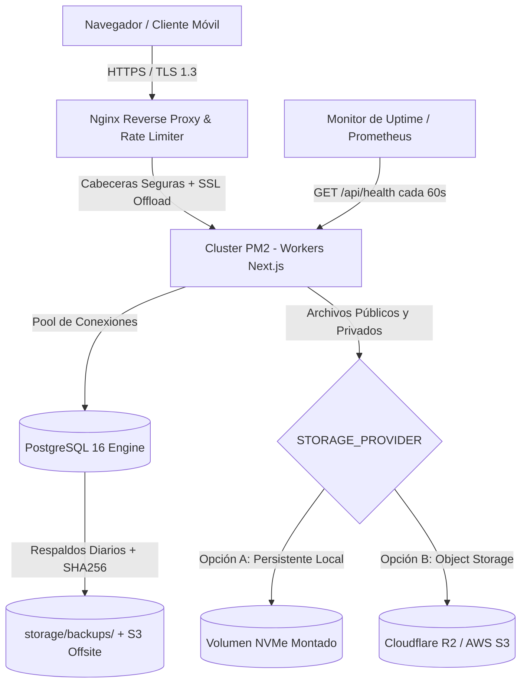

# 🌐 Manual Maestro de Operaciones en Producción — TiendaDelki

Este documento establece las políticas operativas, arquitectura de seguridad, gestión de almacenamiento persistente, monitoreo, observabilidad y procedimientos de mantenimiento para garantizar que **TiendaDelki** permanezca en línea, segura y resiliente de forma ininterrumpida a lo largo de los años.

---

## 1. Arquitectura de Alta Disponibilidad y Resiliencia



---

## 2. Variables de Entorno y Protección Criptográfica de Secretos

El sistema cuenta con un validador centralizado en `src/config/env.ts` que previene el arranque del servidor si los parámetros de producción presentan vulnerabilidades o valores por omisión.

### 2.1 Reglas de Validación en Producción
- **Prohibición de Secretos por Defecto:** Si `JWT_SECRET` o `SESSION_SECRET` contienen palabras como `"secret"`, `"default"`, `"change_this"`, o longitud menor a 32 caracteres, la aplicación lanzará una excepción fatal durante el inicio impidiendo el despliegue inseguro.
- **Protocolo Seguro Obligatorio:** `NEXT_PUBLIC_APP_URL` **debe** comenzar con `https://`. Se rechazan URLs con `http://` en producción.
- **Validación de S3/R2:** Si `STORAGE_PROVIDER="s3"`, el validador verifica la existencia obligatoria de `S3_BUCKET_NAME`, `S3_REGION`, `S3_ACCESS_KEY_ID` y `S3_SECRET_ACCESS_KEY`.

### 2.2 Generación de Secretos de Producción
Nunca use contraseñas legibles ni reutilice claves. Ejecute en su consola:
```bash
# Generar JWT_SECRET (256 bits)
openssl rand -hex 32

# Generar SESSION_SECRET (256 bits)
openssl rand -hex 32

# Generar contraseña para PostgreSQL
openssl rand -base64 24
```

### 2.3 Política de Rotación y Custodia
- Mantenga el archivo `.env` fuera del control de versiones (`.gitignore`).
- Asigne permisos de lectura exclusivos al usuario del sistema: `chmod 600 .env`.
- En caso de sospecha de filtración de claves, rote `JWT_SECRET` inmediatamente; esto invalidará las sesiones activas obligando a los usuarios a reautenticarse limpiamente.

---

## 3. Seguridad de Cabeceras HTTP, CORS y Políticas del Navegador

La aplicación incluye cabeceras de seguridad estrictas inyectadas a través de `next.config.mjs` y reforzadas por el proxy Nginx:

| Cabecera | Valor en Producción | Propósito |
| :--- | :--- | :--- |
| **Strict-Transport-Security (HSTS)** | `max-age=63072000; includeSubDomains; preload` | Fuerza a todos los navegadores a comunicarse exclusivamente mediante HTTPS durante 2 años. |
| **X-Frame-Options** | `DENY` | Evita ataques de Clickjacking impidiendo que el sitio sea embebido en `<iframe>`. |
| **X-Content-Type-Options** | `nosniff` | Previene ataques de confusión de tipo MIME (MIME-sniffing). |
| **Referrer-Policy** | `strict-origin-when-cross-origin` | Protege la privacidad evitando la fuga de URLs internas a sitios externos. |
| **Permissions-Policy** | `camera=(), microphone=(), geolocation=(), browsing-topics=()` | Deshabilita APIs invasivas de hardware no requeridas por la tienda. |
| **Cross-Origin-Opener-Policy** | `same-origin` | Aísla el contexto de navegación ante ataques espectrales como Spectre. |
| **Content-Security-Policy (CSP)** | Restricción por orígenes específicos | Impide la inyección y ejecución de scripts maliciosos (XSS) y conexiones no autorizadas. |

### 3.1 Seguridad de Cookies de Sesión
Todas las cookies de autenticación generadas por el sistema incorporan los siguientes atributos obligatorios:
- `HttpOnly`: Impide la lectura de la cookie mediante código JavaScript del cliente, mitigando el robo de sesiones por XSS.
- `Secure`: Solo se transmiten a través de túneles cifrados SSL/TLS (HTTPS).
- `SameSite=Lax`: Previene ataques de falsificación de peticiones en sitios cruzados (CSRF).
- `Path=/`: Restringe el contexto de envío al dominio autorizado.

### 3.2 Política CORS
El acceso a la API REST está restringido mediante la variable `ALLOWED_ORIGINS`. Peticiones con orígenes no declarados son denegadas de forma automática:
```ini
ALLOWED_ORIGINS="https://mitienda.com,https://www.mitienda.com"
```

---

## 4. Almacenamiento de Archivos y Mitigación de Filesystem Efímero

> [!WARNING]
> En plataformas en la nube modernas (como Heroku, Render, AWS ECS, Google Cloud Run o contenedores Docker sin volúmenes persistentes), el sistema de archivos del servidor es **efímero**: cualquier archivo guardado localmente en el contenedor se destruye automáticamente al reiniciar el servicio o desplegar una nueva versión.

Para garantizar que **las imágenes de catálogo y los comprobantes bancarios nunca se pierdan**, TiendaDelki cuenta con una arquitectura de almacenamiento desacoplada (`src/core/storage/storage-service.ts`) con dos modos de operación:

### Opción A: Servidor VPS con Volumen Persistente (Modo Local Seguro)
Si utiliza un servidor dedicado o VPS (como Ubuntu en Hetzner, DigitalOcean, Linode u OVH):
- Los archivos se almacenan en un directorio del disco anfitrión fuera del código efímero.
- Configure en `.env`:
  ```ini
  STORAGE_PROVIDER="local"
  UPLOAD_DIR="/var/data/tiendadelki/uploads"
  PRIVATE_STORAGE_DIR="/var/data/tiendadelki/private"
  ```
- Si utiliza Docker, monte este directorio como volumen persistente en `docker-compose.yml`:
  ```yaml
  volumes:
    - /var/data/tiendadelki/uploads:/app/public/uploads
    - /var/data/tiendadelki/private:/app/storage/private
  ```

### Opción B: Object Storage en la Nube (Cloudflare R2 o AWS S3) — Recomendada para Escalabilidad
Cloudflare R2 ofrece almacenamiento compatible con S3 **sin tarifas de transferencia de salida (egress fees)** y alta durabilidad (99.999999999%):

1. Crear un Bucket en Cloudflare R2 (ej. `tiendadelki-assets`).
2. Generar credenciales API (Access Key ID y Secret Access Key).
3. Configurar en `.env`:
   ```ini
   STORAGE_PROVIDER="s3"
   S3_BUCKET_NAME="tiendadelki-assets"
   S3_REGION="auto"
   S3_ENDPOINT="https://<ID_CUENTA_CLOUDFLARE>.r2.cloudflarestorage.com"
   S3_ACCESS_KEY_ID="tu_access_key_id"
   S3_SECRET_ACCESS_KEY="tu_secret_access_key"
   S3_PUBLIC_DOMAIN="https://assets.mitienda.com"
   ```
4. El servicio utiliza internamente autenticación criptográfica AWS SigV4 de alto rendimiento con streams nativos de Node.js, sin sobrecargar la memoria RAM ni depender del disco local.

### 4.1 Protección de Comprobantes Bancarios
- Los comprobantes bancarios cargados por los clientes se dirigen a `PRIVATE_STORAGE_DIR` (o prefijo `private/` en S3).
- **Nunca se publican en carpetas públicas ni se exponen directamente al navegador.**
- Para ser consultados, requieren autenticación activa con rol `ADMIN` en el endpoint `/api/admin/orders/[id]/receipt`.

---

## 5. Manejo de Errores y Degradación Elegante

La aplicación implementa boundaries de error jerárquicos para capturar y neutralizar cualquier fallo no previsto:

- **`src/app/error.tsx`**: Boundary a nivel de aplicación con interfaz cuidada que informa amigablemente al cliente del incidente, registra el identificador de correlación y ofrece un botón de reintento (`reset()`) sin requerir recarga completa del navegador.
- **`src/app/global-error.tsx`**: Boundary crítico para capturar fallos fatales en el layout raíz (`<html>` / `<body>`). Utiliza estilos en línea de emergencia para garantizar la renderización incluso si el motor de estilos CSS colapsa.
- **`src/app/not-found.tsx`**: Página 404 personalizada y brandeada que preserva la confianza del usuario y ofrece navegación hacia el catálogo y la tienda.
- **Prevención de fugas:** En modo `production`, los mensajes de error SQL o detalles internos del servidor son suprimidos hacia el frontend y sustituidos por mensajes genéricos con un identificador único para trazabilidad.

---

## 6. Sistema de Logs Estructurados y Observabilidad

El módulo `src/lib/logger.ts` proporciona logging de nivel empresarial:

### 6.1 Salida JSON en Línea Única (NDJSON)
En producción, todos los logs se emiten en formato JSON estandarizado en una sola línea, ideal para herramientas de agregación (Loki, Elasticsearch, Datadog, CloudWatch):
```json
{"timestamp":"2026-09-06T03:00:00.000Z","level":"info","environment":"production","message":"Pedido registrado exitosamente","orderId":"clw12345","amount":45000}
```

### 6.2 Enmascaramiento Recursivo de Datos Sensibles
El motor de logging inspecciona recursivamente los objetos antes de imprimirlos. Campos sensibles como:
- `password`, `passwordHash`, `token`, `secret`, `jwt`
- `creditCard`, `cardNumber`, `cvv`, `authorization`
- `cookie`, `set-cookie`, `key`

son reemplazados automáticamente por `"[REDACTED]"`, previniendo que credenciales o datos financieros se almacenen inadvertidamente en los registros de texto del servidor.

---

## 7. Diagnóstico de Salud del Sistema (Deep Health Check)

El endpoint `/api/health` permite a sistemas externos (UptimeRobot, BetterStack, Prometheus, AWS Route53) verificar la viabilidad operativa de la tienda en tiempo real:

### 7.1 Métricas Verificadas
1. **Base de Datos PostgreSQL:** Ejecuta una consulta testigo (`SELECT 1`) y mide la latencia de respuesta en milisegundos.
2. **Almacenamiento (Disco / Storage):** Realiza un probe de escritura y eliminación atómica para verificar que el disco no esté en modo solo lectura (`read-only`) ni saturado.
3. **Métricas de Recursos del Proceso:** Reporta memoria física residente (`rssMb`), `heapTotalMb`, `heapUsedMb` y tiempo activo continuo (`uptimeSeconds`).

### 7.2 Códigos de Estado
- **`200 OK` (`"status": "healthy"`):** La base de datos responde rápidamente y el almacenamiento tiene permisos de escritura válidos.
- **`503 Service Unavailable` (`"status": "degraded"`):** Si la base de datos no responde o el disco está bloqueado. Debe disparar alertas críticas inmediatas vía Telegram / Slack / PagerDuty.

---

## 8. Ciclo de Vida y Migraciones de Base de Datos sin Downtime

### 8.1 Regla Fundamental
> [!IMPORTANT]
> En entornos de producción, utilice **únicamente**:
> ```bash
> npm run db:migrate:prod
> ```
> Nunca ejecute `prisma db push` (que puede truncar tablas) ni `prisma migrate dev` (que requiere interactividad y crea migraciones no controladas).

### 8.2 Buenas Prácticas de Migraciones Expansivas (Zero-Downtime)
1. **Añadir nuevas columnas como opcionales (`NULL`) o con valor por defecto:** Permite que las versiones del código actualmente en ejecución continúen funcionando mientras se despliega la nueva versión.
2. **Nunca renombrar columnas directamente en vivo:** En su lugar, cree la nueva columna, copie los datos en segundo plano, actualice el código y finalmente elimine la columna antigua en una release posterior.
3. **Respaldar antes de cada migración:** Ejecute siempre `npm run db:backup` antes de aplicar migraciones mayores.

---

## 9. Lista de Verificación de Mantenimiento Periódico

Para asegurar la longevidad del sistema durante años, establezca la siguiente rutina:

### Mensual:
- [ ] Verificar el tamaño y la integridad de los backups en `/storage/backups/` y en el bucket remoto.
- [ ] Revisar logs de error de Nginx y PM2: `sudo grep -i "error" /var/log/tiendadelki/error.log`.
- [ ] Revisar el uso de espacio en disco: `df -h`.
- [ ] Ejecutar comprobación de seguridad de paquetes: `npm audit`.

### Trimestral:
- [ ] Realizar un simulacro de restauración de base de datos en un entorno de pruebas (`./scripts/restore-db.sh`).
- [ ] Actualizar dependencias de parches de seguridad de Node.js y paquetes del sistema operativo (`sudo apt update && sudo apt upgrade -y`).
- [ ] Optimizar índices de PostgreSQL mediante `VACUUM ANALYZE;`.

### Anual:
- [ ] Rovar credenciales críticas de la infraestructura y llaves de acceso S3/R2.
- [ ] Validar la fecha de expiración del dominio y registros DNS.
- [ ] Verificar la renovación automática de los certificados Let's Encrypt (`certbot renew --dry-run`).
